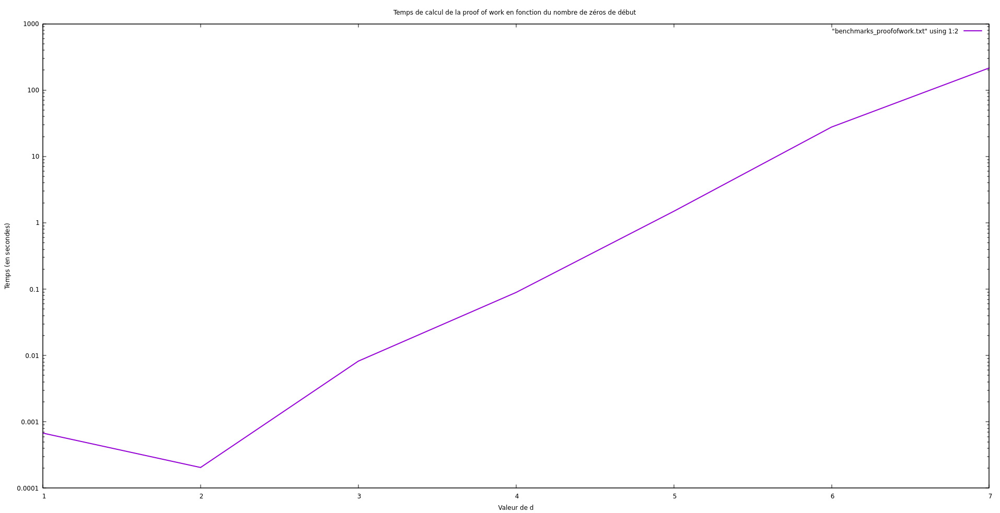

# Rapport de projet
*Damoiseau-Malraux Gaspard & Blanchard-Billard Raphaël*  

Ce projet cherche à reproduire un système de vote électronique sécurisé qui utilise le chiffrement par **RSA**, qui permet le chiffrement asymétrique de messages à l'aide d'une **clef privée** et d'une **clef publique**. La structure des données fonctionne selon un système de **blockchain**, pour assurer la **sécurité**, **l'authentification des votes** et la **décentralisation**.


### Table des matières
1. [Préambule et structure générale du code](###préambule-et-structure-générale-du-code)
1. [Organisation des fichiers](###organisation-des-fichiers)
1. [Structures utilisées](###structures-utilisées)
1. [Jeux de test](###jeux-de-test)
1. [Réponses aux questions](###réponses-aux-questions)
1. [Algorithmes notables](###algorithmes-notables)
1. [Conclusion](###conclusion)


### Préambule et structure générale du code

Le programme se décompose en plusieurs fichiers sources (`exercice`$_i$ ) et de tests (`main`$_i$), qui contiennent les tests des fonctions des fichiers `exercice` correspondants. Chaque fichier source $exercice_i.c$ inclut le fichier source $exercice_{i-1}.c$ . Ainsi, par cascade, exécuter le fichier $main_i.c$ revient à tester l'intégralité des fonctions définies précédemment.

Attention : le fichier `main9.c` est le seul *main* à ne pas proposer de simples tests, mais une simulation complète d'une élection en automatique et aléatoire. Il est encouragé de tester individuellement les *main* dans l'ordre.

Ne pas oublier de créer le dossier `blockchain/`, et ne pas supprimer les fichiers `block.txt` et `testvotes.txt` qui sont utilisés dans des tests !


### Organisation des fichiers

Tous les fichiers de définitions des fonctions importent un fichier *header* jumeau comportant les structures utilisées et les prototypes de fontions.

* `exercice1.c` : fonctions de calculs de nombres premiers et d'exponentiation modulaire, versions naïves et non naïves, opérations mathématiques ;

* `exercice2.c` : génération des valeurs correctes de clefs, chiffrement et déchiffrement de messages selon ces clefs ;

* `exercice3.c` :  création des clefs, des signatures¹ et des protected², signature d'un vote, convertissement de chacune de ces structures en chaîne de caractères et opération inverse ;

* `exercice4.c` : génération de données aléatoires et leur écriture dans 3 fichiers : `nv` votants dans `keys.txt`, `nc` candidats dans `candidates.txt` et `nv` déclarations de votes dans `declarations.txt` ;

* `exercice5.c` : lecture de ces fichiers et restitution en structures, introduction des listes chaînées de clefs et de protected, et opérations sur ces listes (création, insertion, affichage, suppression) ;

* `exercice6.c` : vérification de la validité des déclarations, introduction des tables de hachages et de la fonction de hachage choisie, détermination du vainqueur selon les déclarations lues ;
* `exercice7.c` : introduction des blocs pour la *blockchain*, convertissement d'un bloc en chaîne de caractères et opération inverse, hachage de blocs selon la méthode SHA256, calcul de la *proof of work* (temps de calcul supplémentaire artificiel) ;
* `exercice8.c` : introduction des nœuds de l'arbre pour la *blockchain* (création, initialisation, insertion, gestion de la hauteur), fonction de recherche du chemin le plus long, fusion des votes contenus ;
* `exercice9.c` : ajout des votes à un bloc, ajout de blocs à la *blockchain*, lecture des blocs de cette dernière et création des liens entre eux (*via* le `previous_hash`), détermination du vainqueur de l'élection en comptant les voix de la plus grande chaîne de l'arbre.

Note : la simulation effectuée en fin de projet est parfaite, c'est-à-dire qu'elle ne génère pas de fraude. **Par conséquent, il est normal que l'arbre obtenu ait la forme d'une chaîne simple de nœuds.**

[1, 2] : voir les structures dans [Structures utilisées](###structures-utilisées).


### Structures utilisées

Les structures utilisées sont :

- Dans `exercice3.h` :

```c
typedef struct {
    unsigned long val;
    unsigned long n;
} Key;
```

`Key` contient une valeur `val` unique à la clef et une valeur `n` commune à la paire privée/publique.

```c
typedef struct {
    long* data;
    unsigned int size;
} Signature;
```

`Signature` contient un tableau de `long` et la longueur dudit tableau. Le tableau `data` contient chaque caractère, chiffré, du message initial, sous forme d'un entier `long`.

```c
typedef struct {
    Key* pKey;
    char* msg;
    Signature* signature;
} Protected;
```

`Protected` contient la clef publique `pKey`, une chaîne de caractère `msg` et la signature correspondante dans `Signature`.

* Dans `exercice4.h` :

```c
typedef struct cellProtected {
    Protected* data;
    struct cellProtected * next;
} CellProtected;
```

```c
typedef struct cellKey {
    Key* data;
    struct cellKey * next;
} CellKey;
```

Ces deux dernières structures représentent des listes chaînées des structures respectives.

* Dans `exercice6.h` :

```c
typedef struct {
    HashCell** tab;
    int size;
} HashTable;
```

```c
typedef struct {
    Key* key;
    int val;
} HashCell;
```

`HashTable`représente une tableau de hachage de taille `size`. `HashCell` est comme son nom l'indique une cellule du tableau. La valeur `val` sert à marquer un votant ayant voté, ou à compter le nombre de voix d'un candidat.


### Jeux de test

* `main1.c` teste de performance des fonctions mathématiques ;
* `main2.c` crée un couple de valeurs clefs, les affiches, puis encode et décode une chaîne de caractère ;
* `main3.c` crée deux couple de clef et les convertit en chaîne de caractère. Ces clef sont  ensuite utilisées pour créer une signature qui est affichée et convertie en chaîne de caractères. Cette chaîne est alors reconvertie en signature pour vérifier la réversibilité de l'opération. Enfin, la protection de signature est testée ;
* `main4.c` teste la fonction `generate_random_data` qui génère des votants, des candidats parmi eux et les déclarations de votes. Chacun des votants vote pour un candidat aléatoire. Ces données sont ensuite écrites dans les fichiers `keys.txt`, `candidates.txt` et `declaration.txt` respectivement ;
* `main5.c` affiche les fichiers `keys.txt` et `declaration.txt` générés précédemment, puis supprime toutes les déclarations invalides et les affiche après correction ;
* `main6.c` génère des votants et des candidats dans des fichier comme expliqué précédemment. On extrait ensuite les données des fichiers et on les vérifie. A partir des données vérifiées, on calcule et affiche le vainqueur de l'élection ;
* `main7.c` teste les fonction de hachage `SHA256` et `hash_str`. On lit ensuite un bloc de `block.txt` et on mesure le temps de calcul de la *proof of work* ;
* `main8.c` crée deux blocs arbitrairement à l'aide des votes de `testvotes.txt` et crée un arbre à partir d'eux deux. Vérification du fonctionnement des fonctions basiques de l'exercice 8 ;
* `main9.c` contient le test final : il génère des données aléatoires, stocke les votes par paquets de 10 dans des blocs et reconstruit l'arbre de la *blockchain* à chaque fois pour déterminer le dernier nœud de l'arbre.  On détermine ensuite le vainqueur à partir de l'arbre.
  * Le jeu de tests n°9 indique une relativement petite fuite de mémoire dans `compute_winner_BT` (relative comparée à la quantité de mémoire gérée par le programme). Ce bug est connu mais n'a pas pu être corrigé par faute de temps. Nous soupçonnons la non libération des `CellProtected` dans la fusion des votes, qui doivent être dupliqués pour ne pas altérer l'arbre.


### Réponses aux questions

  <u>**1.1.**</u> La complexité de la fonction `is_prime_naif` est $O(p)$.

  <u>**1.2.**</u> Le plus petit nombre premier calculé en 2 millisecondes ou plus est $318683$.

  <u>**1.3.**</u>  La complexité de la fonction `modpow_naif` est $O(m)$.

  <u>**1.4.**</u>  Performances des fonctions d'exponentiation modulaire :


On voit clairement l'efficacité supérieure du `modpow` non naïf (courbe violette sur l'axe des abscisses) en termes de temps de calcul de $a^m \text{ mod } n$ lorsque $m$ devient très grand (pour $a=2147481647$ et $n=34694$).

  <u>**7.8.**</u> Performances du calcul de la *proof of work* :



L'axe des ordonnées est en échelle logarithmique. On voit qu'ici, nul besoin d'en "déduire" le point à partir duquel le temps de calcul dépasse la seconde, il suffit de le lire : à partir de $d = 5$. La courbe semble plus ou moins linéaire. Étant donnée l'échelle logarithmique, cela signifie une augmentation exponentielle.

  <u>**8.8.**</u> La fonction `fusion_chaines` a une complexité en $O(n)$. On pourrait atteindre une complexité en $O(1)$ en utilisant une structure de listes doublement chaînées.


### Algorithmes notables

La majorité des fonctions de ce projet sont codées de manière à être suffisamment claires pour ne pas nécessiter d'explication (variables explicites, commentaires ponctuels). Néanmoins, certains algorithmes utilisés peuvent tout de même nécessiter une explication synthétique. Bien que ces fonctions sont particulièrement commentées, il peut être utile d'expliquer l'idée derrière le programme.

* `random_prime_number` part du [postulat de Bertrand](https://fr.wikipedia.org/wiki/Postulat_de_Bertrand). Elle prend un entier dans l'intervalle donné (entre deux puissances de 2), puis parcourt cet intervalle de manière croissante jusqu'à trouver un nombre premier. Si aucun nombre n'a été trouvé, la fonction retourne au nombre sélectionné aléatoirement et parcourt l'intervalle vers le bas.

  ```c
  long random_prime_number(int low_size, int up_size, int k) {
      long min = pow(2, low_size), max = pow(2, up_size);
  
      long pivot = rand_long(min, max);  // Take a random integer in the interval
  
      // Iterating upwards to the first prime number found starting from the pivot
      for (long i = pivot; i <= max; i += (i & 1 ? 2 : 1)) {  // (i & 1 ? 2 : 1) ensures checking only odd numbers
          if (is_prime_miller(i, k)) return i;
      }
  
      // If nothing found, iterating downwards in the interval
      for (long i = pivot; i >= min; i -= (i & 1 ? 2 : 1)) {
          if (is_prime_miller(i, k)) return i;
      }
  
      // Should never trigger (the interval should always have prime numbers)
      printf("Pas de nombre premier dans l'intervalle donné.\n"); return -1;
  }
  ```

* `supprimer_invalides` vérifie d'abord la validité de la liste chaînée à l'exception du premier élément. Cet élément est vérifié manuellement après cela. Cela permet de simplifier le code de la fonction et ne pas avoir à faire des cas spéciaux dans sa structure, tout en gardant une simplicité à la lecture et exactement le même résultat pour des performances identiques.

  ```c
  void supprimer_invalides(CellProtected** l) {
      /* Removes and frees all invalid protected from the list */
  
      CellProtected* copie = *l;
  
      if (copie == NULL) return;
  
      // We will check the first elemement at the end
      while (copie->next != NULL) {
          if (!verify(copie->next->data)) {
              CellProtected* temp = copie->next;
              copie->next = copie->next->next;
              delete_cell_protected(temp);
          } else {
              copie = copie->next;
          }
      }
  
      copie = *l;
  
      // Checking the first element
      if (!verify(copie->data)) {
          *l = copie->next;
          delete_cell_protected(copie); 
      }
  }
  ```


### Conclusion

En conclusion, un système de vote électronique par *blockchain* est utile sur plusieurs points. D'abord parce que cela permet un vote à distance, ce qui peut effectivement participer à réduire l'abstention et à augmenter la confiance en la légitimité de l'élection. En effet, par la décentralisation, chacun possède copie ou partie de la *blockchain* sur son ordinateur. Il est très difficile de frauder dans une élection pareille, car il faudrait alors contrôler plus de 50% des éléments du réseau de la *blockchain* pour valider un vote frauduleux. Néanmoins, dans un cadre comme ici, il existe tout de même des moyens de falsifier une élection (comme de noyer de faux votes la *blockchain* juste avant la fermeture des votes). Par ailleurs, une *blockchain* telle que nous l'avons implémentée ici empêche l'anonymat des votes. C'est donc un outil très utile, mais qui possède ses limites.

###### 
